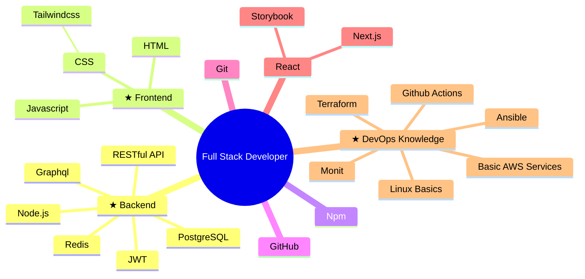

# Still on top of things

### On Top Of Things

# gitlek

#### Header 3

##### Header 4

At the command prompt, type `nano`

> Code is like humor. When you have to explain it, it’s bad.

```mermaid
  mindmap
  root((Full Stack Developer))
    ★ Backend
        Node.js
        Graphql
        PostgreSQL
        RESTful API
        JWT
        Redis
    ★ Frontend
      HTML
      CSS
        Tailwindcss
      Javascript
    Npm
    GitHub
    Git
    React
        Next.js
        Storybook
    ★ DevOps Knowledge
        Linux Basics
        Basic AWS Services
        Monit
        Github Actions
        Ansible
        Terraform
```
